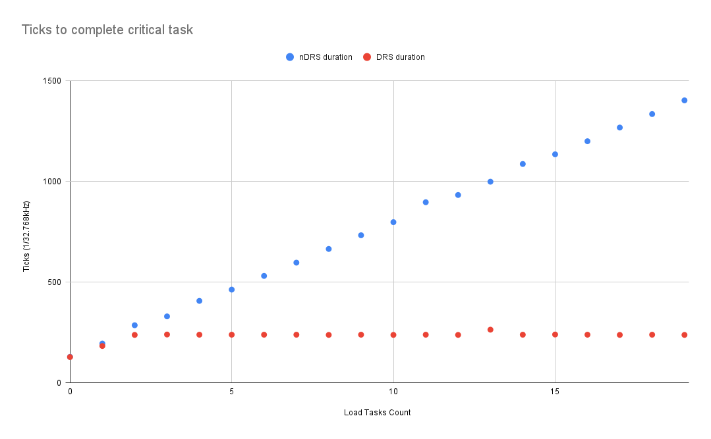
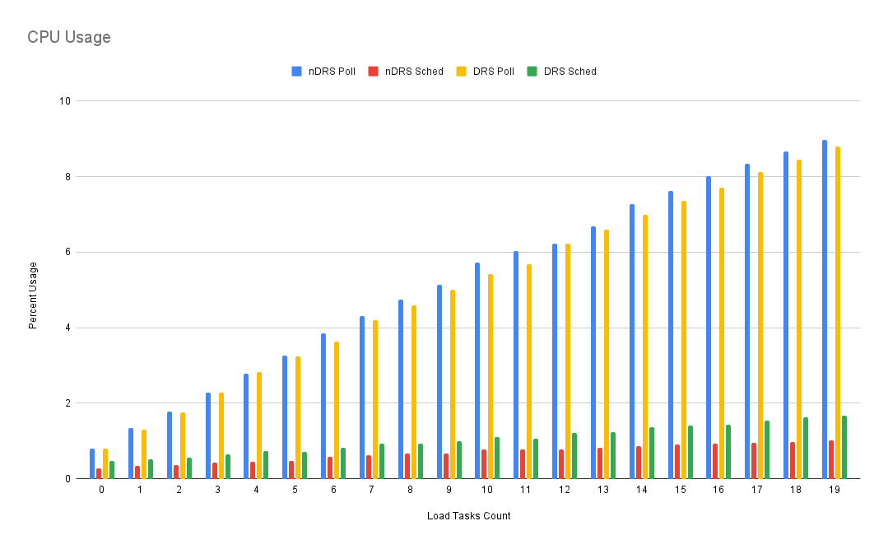

# Results

Consists of data from:

* [non-drs-002.txt](./non-drs-002.txt)
* [yes-drs-002.txt](./yes-drs-002.txt)

## Table

Each scenario consisted of:

* N Load tasks: Each worker task was set to perform 65 ticks (appx 2ms) of work on every trigger
* 1 "Critical" task: Set to perform:
    * Start deadline on trigger
    * 33 ticks (appx 1ms) of work
    * 11 ticks (appx 1/3ms) of sleep
    * 33 ticks (appx 1ms) of work
    * 11 ticks (appx 1/3ms) of sleep
    * 33 ticks (appx 1ms) of work
    * Complete deadline

Load tasks were pulsed 16x, with 250ms between pulses. The critical task ran on one of these pulses.

| Load Tasks    | nDRS duration | nDRS Poll | nDRS Sched    | nDRS Idle | DRS duration  | DRS Poll  | DRS Sched | DRS Idle  |
| :---          | :---          | :---      | :---          | :---      | :---          | :---      | :---      | :---      |
| 0             | 129           | 0.79      | 0.28          | 98.93     | 128           | 0.79      | 0.47      | 98.74     |
| 1             | 195           | 1.34      | 0.34          | 98.32     | 183           | 1.31      | 0.52      | 98.17     |
| 2             | 286           | 1.77      | 0.36          | 97.87     | 238           | 1.75      | 0.55      | 97.7      |
| 3             | 330           | 2.29      | 0.42          | 97.29     | 240           | 2.28      | 0.64      | 97.08     |
| 4             | 407           | 2.79      | 0.45          | 96.76     | 239           | 2.83      | 0.73      | 96.44     |
| 5             | 463           | 3.27      | 0.48          | 96.25     | 239           | 3.24      | 0.72      | 96.04     |
| 6             | 531           | 3.84      | 0.57          | 95.59     | 239           | 3.63      | 0.81      | 95.56     |
| 7             | 597           | 4.31      | 0.63          | 95.06     | 239           | 4.19      | 0.93      | 94.88     |
| 8             | 665           | 4.75      | 0.66          | 94.59     | 238           | 4.6       | 0.94      | 94.46     |
| 9             | 733           | 5.14      | 0.67          | 94.19     | 239           | 5.01      | 1         | 93.99     |
| 10            | 798           | 5.72      | 0.77          | 93.51     | 238           | 5.42      | 1.11      | 93.47     |
| 11            | 897           | 6.04      | 0.77          | 93.19     | 239           | 5.69      | 1.07      | 93.24     |
| 12            | 933           | 6.23      | 0.78          | 92.99     | 238           | 6.22      | 1.21      | 92.57     |
| 13            | 999           | 6.68      | 0.82          | 92.5      | 264           | 6.59      | 1.24      | 92.17     |
| 14            | 1087          | 7.28      | 0.86          | 91.86     | 239           | 6.99      | 1.37      | 91.64     |
| 15            | 1135          | 7.62      | 0.91          | 91.47     | 240           | 7.35      | 1.4       | 91.25     |
| 16            | 1200          | 8.02      | 0.93          | 91.05     | 239           | 7.71      | 1.42      | 90.87     |
| 17            | 1268          | 8.34      | 0.96          | 90.7      | 238           | 8.13      | 1.53      | 90.34     |
| 18            | 1335          | 8.67      | 0.98          | 90.35     | 239           | 8.45      | 1.63      | 89.92     |
| 19            | 1403          | 8.98      | 1.01          | 90.01     | 238           | 8.79      | 1.67      | 89.54     |

## Deadline graph

This graph shows how many "Wall clock" ticks from "start" it took the critical task to complete the given task.

## CPU Usage graph

This graph shows the aggregate CPU utilization during the entire scenario, including some setup/teardown time

